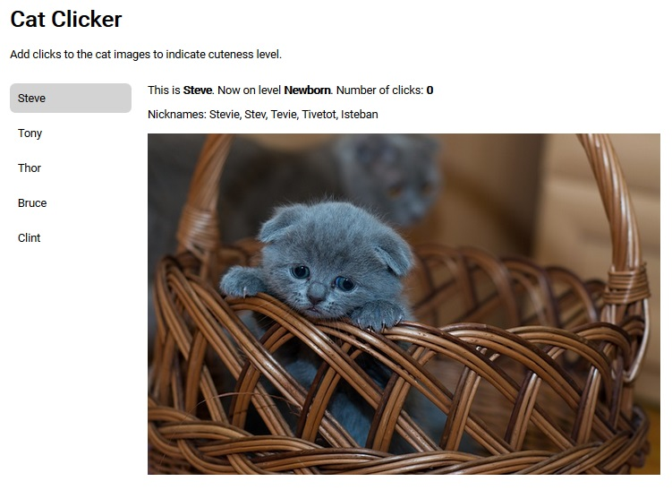

# Cat Clicker

_For learning about KnockoutJS Framework._

----

The application shows a list of cats to choose from. The details about the
selected cat shown in the viewing area include its name, level, number of click, 
nicknames and image. When the cat's image is clicked, the number of clicks is
incremented. The cat's level is computed as the number of clicks go up.

----

